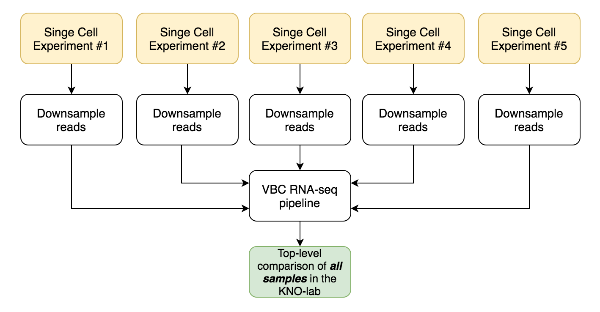

# Cluster-specific pseudo-bulk analysis of 10X single-cell RNA-seq data
Cluster-specific pseudo-bulk analysis of 10X single-cell RNA-seq data by connecting to the VBC RNA-seq pipeline.  


## Introduction

See [Document on pseudo-bulk analysis](https://docs.google.com/document/d/1ovm_zODzLBQFwBWld5TOh_-6oKZLVzFC0okTD1KtXIA/edit#) and my [presentation on pseudo-bulk analysis](https://docs.google.com/presentation/d/1ZmMXPeaHUreifUDmtCzh9qfTK5JzRVxLkPWADRSvTyE/edit?usp=sharing). In brief, pseudo-bulk analysis allows

1. top-level overview & comparison of all single-cell datasets generated in the lab 
2. comparison single-cell-clusters vs bulk (sorted) RNA-seq samples
3. in depth study of sequencing libraries (read position distributions, extensive quality control).
4. Separation of .bam files per sample (in case of sample pooling, e.g. MULTI-SEQ)


## Pseudo-bulk analysis for *top-level* overview 




***Top-level*** overview is very simple and does not require preprocessing in R.


## Pseudo-bulk analysis for *cluster-specific* comparisons


***Cluster-specific*** overview requires preprocessing in R and the export of barcodes. The exported barcodes then will be processed by 


# Steps for the cluster-specific analysis

## 1. Run SeuratFind clusters, etc.

[explained elsewhere] 

##2 Export clusters

Depends: CodeAndRoll.R, and MarkdownReports

Use get.ls.of.CBCs and write.out.CBCs.per.cl to write out the barcodes per dataset, per cluster. Script found in: /Users/abel.vertesy/GitHub/Seurat.multicore/Seurat3.Write.Out.CBCs.for.subset-bam.R


```r
get.ls.of.CBCs <- **function**(scobj = combined.obj, ident = 'integrated_snn_res.0.3', 
              plotit=T, trim.libName=F) { # 
 Idents(scobj) <- ident
 id_x = Idents(scobj)
 dsets = unique(stringr::str_split_fixed(names(id_x), pattern = '_', n = 2)[,2])
 iprint("Returns a list of lists (",l(dsets),"libraries [",dsets,"] /",
     l(levels(id_x)),"clusters [",levels(id_x),"] )")
 ls_CBCs = list.fromNames(levels(id_x))
 print("Cluster:")

 **for** (cl **in** 1:l(levels(id_x))) { 
  print(cl)
  cells_x = WhichCells(combined.obj, idents = id_x[cl])
  cells_perLib = stringr::str_split_fixed(cells_x, pattern = '_', n = 2)
  cells_perLib = cbind(cells_perLib,scobj$orig.ident[cells_x])
  ls_CBCs[[cl]] <- ls_cells_clX_perLib <- split(x = cells_perLib, f = cells_perLib[,3])
 }
 revlist = reverse.list.hierarchy(ls_CBCs)

 **if** (!isFALSE(trim.libName)) { # remove .WT **and** .TSC2
  names(revlist) = stringr::str_split_fixed(names(revlist), pattern = "\\.", n=2)[,1]
 }
 **if** (plotit) {
  **for** (i **in** 1:l(revlist)) {
   ClusterSizes = unlapply(revlist[[i]], l)
   wpie(ClusterSizes, savefile = F, plotname = paste('ClusterSizes, cl.', i))
  }
 }
 **return**(revlist)
}
# ls.of.CBCs = get.ls.of.CBCs(trim.libName = T); names(ls.of.CBCs)

# *------------------------------------------------------------*

write.out.CBCs.per.cl <- **function**(ls_CBCs = ls.of.CBCs, add.suffix="-1", openOutDir=T) { # take the output of get.ls.of.CBCs() as input, **and** write out as csv
 (depth = l(ls_CBCs))
 (dsets = names(ls_CBCs))
 **for** (i **in** 1:l(dsets)) {
  outputDir = p0(OutDir,"CBCs/", dsets[i])
  dir.create(outputDir, recursive = T)
  inside.ls = ls_CBCs[[i]]
  **for** (j **in** 1:l(inside.ls)) {
   CBCs = inside.ls[[j]]
   **if** (!isFALSE(add.suffix)) CBCs = p0(CBCs,add.suffix)
   write.simple.vec(input_vec = CBCs, ManualName =  p0(outputDir,"/Cl.", j, ".csv"))
  }
 }
 **if** (openOutDir) system(paste("open", outputDir))
}
# write.out.CBCs.per.cl()
```


## 3. Copy output folder next to bam folder

Example folder structure:


## 4 Subset bam by **run**.**split**-bam.**sh**

[Barcoded BAM is described here](https://support.10xgenomics.com/single-cell-gene-expression/software/pipelines/latest/output/bam). [Alternative method is described here](https://kb.10xgenomics.com/hc/en-us/articles/360022448251-Is-there-way-to-filter-the-BAM-file-produced-by-10x-pipelines-with-a-list-of-barcodes-)

Depends: [10XGenomics/subset-bam](https://github.com/10XGenomics/subset-bam) 

Script found in: `/Users/abel.vertesy/GitHub/Seurat.multicore/split.bam.files.scripts/run.split-bam.sh`:

```bash
# https:*//github.com/10XGenomics/subset-bam*
# alternative scripts: https:*//divingintogeneticsandgenomics.rbind.io/post/split-a-10xscatac-bam-file-by-cluster/*

# --bam (-b): **Input** 10x Genomics BAM. This BAM must have the CB tag to define the barcodes of cell barcodes (or the tag defined **by** --bam-tag). Must also have **an** index (.bai) **file**. REQUIRED.
# --cell-barcodes (-c): A cell barcodes **file** **as** produced **by** Cell Ranger that defines **which** barcodes were called **as** cells. **One** barcode per **line**. **In** Cell Ranger runs, this can be found **in** the sub-folder **outs**/filtered_gene_bc_matrices_mex/${refGenome}/barcodes.tsv where ${refGenome} is the name of the reference genome used **in** your Cell Ranger **run**. This **file** can be used **as** column labels **for** the output **matrix**. REQUIRED.
# --**out**-bam (-o): A path to write the subsetted BAM **file** to. REQUIRED.
# --cores: Number of parallel cores to **use**. DEFAULT: 1.
# --**log**-level: **One** of info, **error** or debug. Increasing **levels** of logging. DEFAULT: **error**.
# --bam-tag: Change this to **use** **an** alternative tag to the default CB tag. This can be useful **for** subsetting BAMs from LongRanger.


"on server"
tmux 
cdd /groups/knoblich/users/abel/Data/

# lib="101147"
lib="101146"

bamdir="bam.files.cellranger/"$lib
bamfile=$bamdir/$(**ls** $bamdir | grep ".bam$")
outdir=$bamdir"/bam.per.cl/"
**mkdir** $outdir
BCdir="CBCs/"$lib"/"

**for** BC **in** $(**ls** $BCdir | grep ".csv")
**do**
  BCfile=$BCdir$BC
  echo $BCfile
  echo $bamfile
  outbam=$outdir$BC".bam"
  echo $outbam
  subset-bam --cores 8 --bam $bamfile --cell-barcodes $BCfile --**out**-bam $outbam --**log**-level debug
done

# samtools **view** /Volumes/abel/Data/bam.files.cellranger/101146/bam.per.**cl**/**Cl**.1.csv.bam | head
# samtools **view** /Volumes/abel/Data/bam.files.cellranger/101146/Oli.d110.101146.WT.bam | head -100
```


##5  Reanalyzing with the VBC RNA-seq pipeline

Described elsewhere

